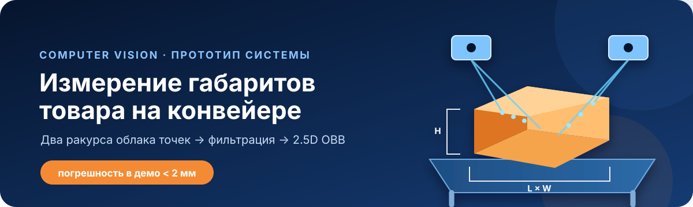
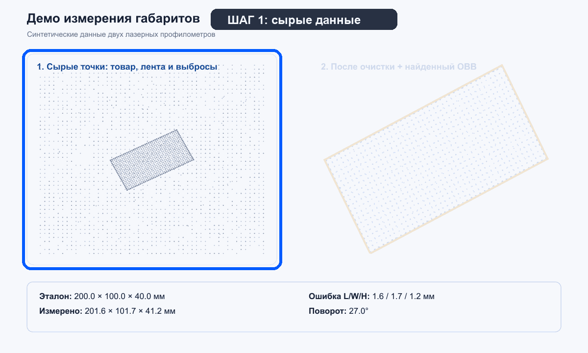
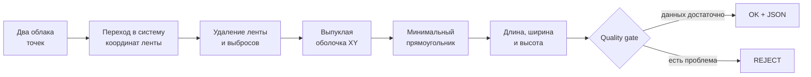

<div align="center">
  
</div>

<div align="center">
  <a href="https://github.com/GrigsyChudin/ozon-conveyor-dimensions/actions/workflows/tests.yml"></a>
  
  
  
</div>

<p align="center">
  Базовый алгоритм для оценки длины, ширины и высоты товара<br>
  по двум синтетическим ракурсам облака точек.
</p>

<p align="center">
  <a href="#демо"><b>Демо</b></a> ·
  <a href="#быстрый-запуск"><b>Запуск</b></a> ·
  <a href="#как-это-работает"><b>Алгоритм</b></a> ·
  <a href="docs/ALGORITHM.md"><b>Техническое описание</b></a>
</p>

---

## О проекте

Прототип для тестового задания мастерской Ozon по треку «Компьютерное
зрение». Настоящие сенсоры не требуются: программа сама создаёт два облака
точек, добавляет конвейерную ленту, шум и выбросы, а затем восстанавливает
габариты объекта.

| Результат стандартного демо | Значение |
|---|---:|
| Эталон, Д × Ш × В | `200 × 100 × 40 мм` |
| Измерено, Д × Ш × В | `201.59 × 101.65 × 41.23 мм` |
| Максимальная абсолютная ошибка | `1.65 мм` |
| Проверка допуска из задания | ✅ пройдена |

## Демо

<div align="center">
  
  <br>
  <sub>Слева — два исходных ракурса; справа — очищенное облако и найденный прямоугольник.</sub>
</div>

После запуска программа также сохраняет `result.json`, `filtered_points.csv` и
векторную визуализацию `demo.svg`.

## Как это работает



Основные шаги:

1. Облака двух сенсоров переводятся в систему координат ленты.
2. Точки около `z = 0` считаются лентой и удаляются.
3. Одиночные 3D-точки убираются radius-фильтром на пространственной сетке.
4. По проекции XY строится выпуклая оболочка.
5. Методом вращающихся калиперов ищется прямоугольник минимальной площади.
6. Высота считается от плоскости ленты до верхней точки товара.
7. Quality gate возвращает `REJECT`, если данных недостаточно.

Подробное объяснение: [docs/ALGORITHM.md](docs/ALGORITHM.md).

## Что реализовано

- генератор двух синтетических ракурсов;
- шум, пропуски, лента и одиночные выбросы;
- фильтрация и объединение облаков точек;
- 2D convex hull и ограничивающий прямоугольник;
- оценка `length / width / height` и угла поворота;
- проверка допуска отдельно по каждой стороне;
- quality gate для пустых или неполных данных;
- экспорт результата в JSON, CSV и SVG;
- 10 unit-тестов и автоматическая проверка через GitHub Actions.

## Быстрый запуск

Понадобится Python 3.10 или новее.

```bash
git clone git@github.com:GrigsyChudin/ozon-conveyor-dimensions.git
cd ozon-conveyor-dimensions
python3 -m venv .venv
source .venv/bin/activate
python -m pip install -e .
ozon-dim-demo
```

Вариант без установки пакета:

```bash
PYTHONPATH=src python run_demo.py
```

### Свои параметры

```bash
ozon-dim-demo \
  --length 300 \
  --width 120 \
  --height 80 \
  --yaw 35 \
  --seed 10 \
  --output-dir my_demo
```

Критерий задания проверяется для каждой стороны отдельно:

```text
abs(measured - truth) <= max(5% * truth, 5 мм)
```

## Тесты

```bash
PYTHONPATH=src python -m unittest discover -s tests -v
```

Тесты покрывают повёрнутый объект, перестановку длины и ширины, выбросы,
непрямоугольную форму и несколько сценариев отказа quality gate.

## Ограничения базовой версии

Текущее демо реализует 2.5D-подход на NumPy: минимальный прямоугольник
ищется в плоскости ленты, а высота измеряется по оси Z. Метод рассчитан на
объекты, расположенные на опорной плоскости конвейера без значительного наклона.

Для полной 3D-ориентации в промышленной версии предлагается Open3D
`MINIMAL_JYLANKI`. Демо также не моделирует физику лазерной линии, энкодер,
временную развёртку и все возможные окклюзии. HTTP-отправка в WMS заменена
локальным файлом `result.json`.

Это не готовая промышленная система: перед работой на настоящем конвейере
понадобятся калибровка, проверка лазерной безопасности и испытания на реальных
упаковках.

## Подключение реальных Gocator

Синтетический генератор можно заменить адаптером LMI SDK. Для каждого профиля
нужно получить `x`, `z`, intensity и encoder tick, вычислить
`y = tick * mm_per_tick`, применить матрицу `T_sensor_to_belt` и передать массив
`(N, 3)` в `measure_object`.

## Структура проекта

```text
src/ozon_dimension_demo/
  geometry.py       геометрия, hull, OBB и фильтр
  pipeline.py       обработка и quality gate
  synthetic.py      генератор двух ракурсов
  visualization.py  SVG без тяжёлых библиотек
  cli.py            командная строка
tests/               unit-тесты
docs/ALGORITHM.md    описание алгоритма
demo_output/         готовый пример результата
```

---

<p align="center">
  Python · NumPy · обработка облаков точек
</p>
